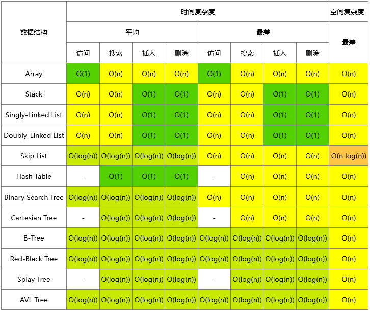
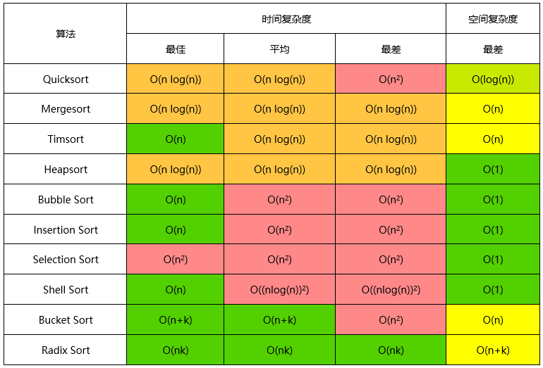
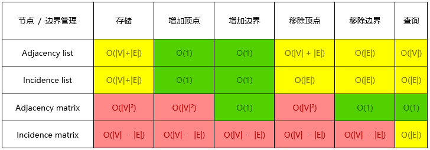
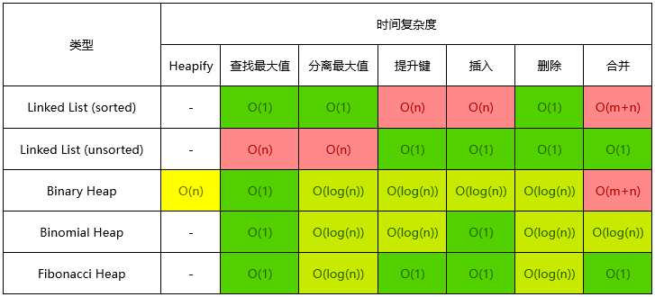

## 每个程序员都应该收藏的算法复杂度速查表

### 算法复杂度这件事

这篇文章覆盖了计算机科学里面常见算法的时间和空间的大O（Big-O）复杂度。我之前在参加面试前，经常需要花费很多时间从互联网上查找各种搜索和排序算法的优劣，以便我在面试时不会被问住。最近这几年，我面试了几家硅谷的初创企业和一些更大一些的公司，如 Yahoo、eBay、LinkedIn 和 Google，每次我都需要准备这个，我就在问自己，“为什么没有人创建一个漂亮的大 O 速查表呢？”所以，为了节省大家的时间，我就创建了这个，希望你喜欢！

### 图例

### 数据结构操作

### 数组排序算法

### 图操作

### 堆操作

### 大O复杂度图表

