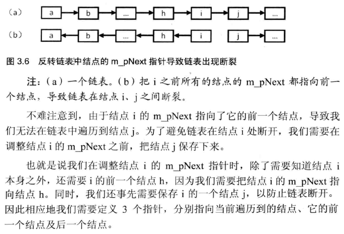

## 反转链表

定义一个函数，输入一个链表的头结点，反转该链表并输出反转后链表的头结点。



```c++
struct ListNode
{
    int       m_nValue;
    ListNode* m_pNext;
};

ListNode* ReverseList(ListNode* pHead)
{
    ListNode* pReversedHead = NULL;
    ListNode* pNode = pHead;
    ListNode* pPrev = NULL;
    while(pNode != NULL)
    {
        ListNode* pNext = pNode->m_pNext;

        if(pNext == NULL)
            pReversedHead = pNode;

        pNode->m_pNext = pPrev;

        pPrev = pNode;
        pNode = pNext;
    }

    return pReversedHead;
}
```