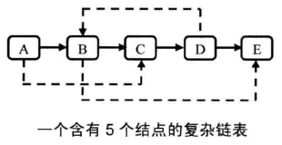
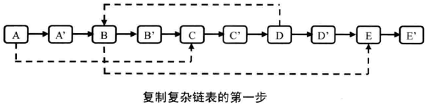
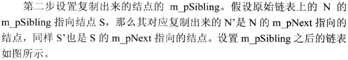
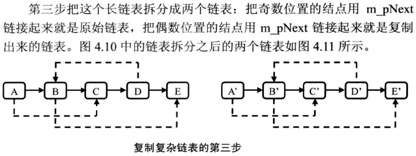

## 复杂链表的复制

实现函数 ComplexListNode* Clone(ComplexListNode* pHead)，复制一个复杂链表。在复杂链表中，每个结点除了有一个m_pNext指针指向下一个结点，还有一个 m_pSibling 指向链表中的任意结点或者NULL。



```c++
struct ComplexListNode
{
    int                 m_nValue;
    ComplexListNode*    m_pNext;
    ComplexListNode*    m_pSibling;
};
```




```c++
void CloneNodes(ComplexListNode* pHead)
{
    ComplexListNode* pNode = pHead;
    while(pNode != NULL)
    {
        ComplexListNode* pCloned = new ComplexListNode();
        pCloned->m_nValue = pNode->m_nValue;
        pCloned->m_pNext = pNode->m_pNext;
        pCloned->m_pSibling = NULL;
 
        pNode->m_pNext = pCloned;
 
        pNode = pCloned->m_pNext;
    }
}
```



```c++
void ConnectSiblingNodes(ComplexListNode* pHead)
{
    ComplexListNode* pNode = pHead;
    while(pNode != NULL)
    {
        ComplexListNode* pCloned = pNode->m_pNext;
        if(pNode->m_pSibling != NULL)
        {
            pCloned->m_pSibling = pNode->m_pSibling->m_pNext;
        }
 
        pNode = pCloned->m_pNext;
    }
}
```


```c++
ComplexListNode* ReconnectNodes(ComplexListNode* pHead)
{
    ComplexListNode* pNode = pHead;
    ComplexListNode* pClonedHead = NULL;
    ComplexListNode* pClonedNode = NULL;
 
    if(pNode != NULL)
    {
        pClonedHead = pClonedNode = pNode->m_pNext;
        pNode->m_pNext = pClonedNode->m_pNext;
        pNode = pNode->m_pNext;
    }
 
    while(pNode != NULL)
    {
        pClonedNode->m_pNext = pNode->m_pNext;
        pClonedNode = pClonedNode->m_pNext;
 
        pNode->m_pNext = pClonedNode->m_pNext;
        pNode = pNode->m_pNext;
    }
 
    return pClonedHead;
}
```
把上面三步合起来，就是复制复杂链表的完整过程：
```c++
ComplexListNode* Clone(ComplexListNode* pHead)
{
    CloneNodes(pHead);
    ConnectSiblingNodes(pHead);
    return ReconnectNodes(pHead);
}
```

