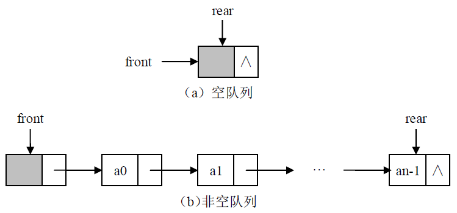

### 队列的链式存储实现



```java
public interface Node {
    //获取结点数据域
	public Object getData();
	//设置结点数据域
	public void setData(Object obj);
}
```

```java
public class SLNode implements Node {
	
	private Object element;
	private SLNode next;
	
	public SLNode() {
		this(null,null);
	}
	
	public SLNode(Object ele, SLNode next){
		this.element = ele;
		this.next = next;
	}

	public SLNode getNext(){
		return next;
	}
	
	public void setNext(SLNode next){
		this.next = next;
	}
	/****************Node Interface Method**************/
	public Object getData() {
		return element;
	}

	public void setData(Object obj) {
		element = obj;
	}	
}
```

```java
public class QueueSLinked implements Queue {
	private SLNode front;
	private SLNode rear;
	private int    size;
	public QueueSLinked() {
		front = new SLNode();
		rear = front;
		size = 0;
	}

	//返回队列的大小
	public int getSize() {
		return size;
	}

	//判断队列是否为空
	public boolean isEmpty() {
		return size==0;
	}

	//数据元素e入队
	public void enqueue(Object e) {
		SLNode p = new SLNode(e,null);
		rear.setNext(p);
		rear = p;
		size++;
	}

	//队首元素出队
	public Object dequeue() throws QueueEmptyException {
		if (size<1)
			throw new QueueEmptyException("错误：队列为空");
		SLNode p = front.getNext();
		front.setNext(p.getNext());
		size--;
		if (size<1) rear = front;	//如果队列为空,rear指向头结点
		return p.getData();
	}

	//取队首元素
	public Object peek() throws QueueEmptyException {
		if (size<1)
			throw new QueueEmptyException("错误：队列为空");
		return front.getNext().getData();
	}	
}
```